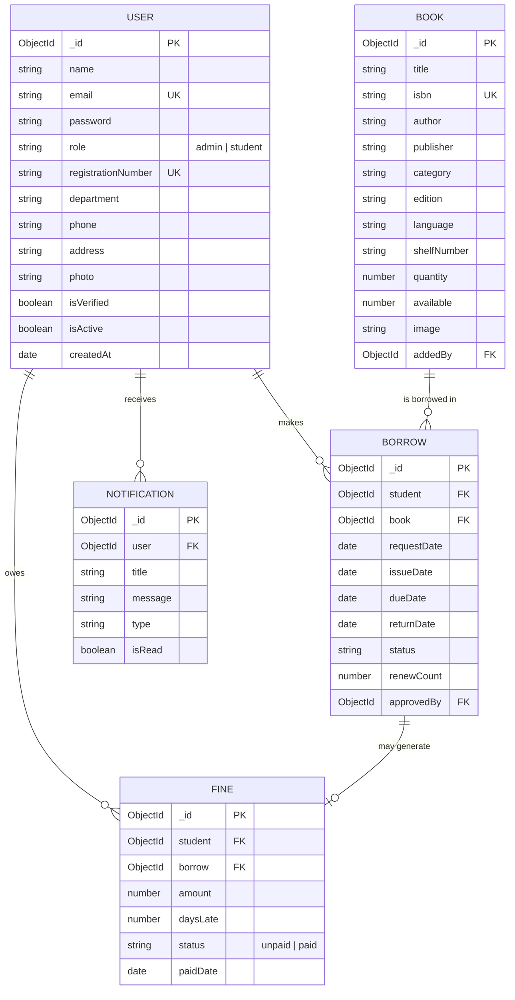

# Entity Relationship Diagram (Description)

> Paste this into draw.io / Lucidchart / a Mermaid renderer for your thesis appendix. A Mermaid ER diagram is included below and renders directly on GitHub.

## Relationship Summary
- One **User** (student) can have many **Borrow** records (1:N)
- One **Book** can appear in many **Borrow** records over time (1:N)
- One **Borrow** record generates at most one **Fine** (1:0..1) — only created if returned late
- One **User** can have many **Fines** (1:N) and many **Notifications** (1:N)
- **Admin** users create/manage Books, approve/reject Borrows, and mark Fines as paid
